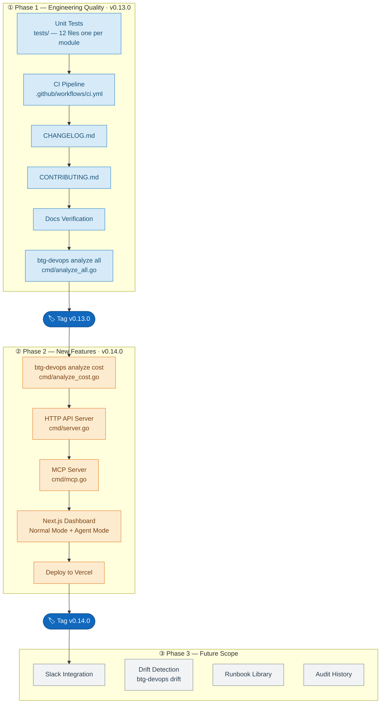

# btg-devops — Project Roadmap

This roadmap shows the three delivery phases for btg-devops. Each phase must be completed before the next begins.

---

---

## Phase Summary

### Phase 1 — Engineering Quality (v0.13.0)
Adds the safety net the project needs before new features. No new functionality — only tests, CI, and documentation.

| Task | Description |
|---|---|
| Unit Tests | 12 test files — one per analyzer module |
| CI Pipeline | Auto build → test → lint on every PR |
| CHANGELOG.md | Version history from v0.12.0 |
| CONTRIBUTING.md | Build, test, lint, PR guide for contributors |
| Docs Verification | Confirm all 12 module docs match the code |
| `analyze all` | Run all 12 analyzers in one command |

### Phase 2 — New Features (v0.14.0)
Extends the tool with cost reporting, a REST API, MCP integration, and a live web dashboard.

| Task | Description |
|---|---|
| `analyze cost` | Azure Cost Management billing report |
| HTTP API Server | REST endpoints for dashboard Normal Mode |
| MCP Server | Exposes 12 analyzers as MCP tools for Agent Mode |
| Next.js Dashboard | Two-mode web UI — Normal Mode and Agent Mode |
| Deploy to Vercel | Public dashboard URL |

### Phase 3 — Future Scope
Planned after Phase 2 is stable.

| Task | Description |
|---|---|
| Slack Integration | Post audit findings to DevOps team channel |
| Drift Detection | IaC vs live Azure configuration comparison |
| Runbook Library | Searchable operational runbooks in dashboard |
| Audit History | View previous audit results and trends |